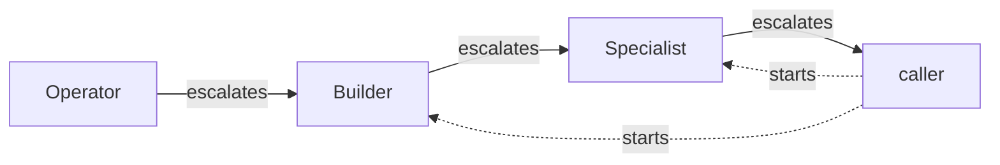

# agents

[Português](README.pt-BR.md)

A ladder of five agents for Claude Code and Codex, ordered by task complexity.

## The ladder

| Agent | Use when | Claude pin | Codex pin |
|---|---|---|---|
| Operator | Change is fully decided to the exact detail |  |  |
| Researcher | Read-only investigation of any source |  |  |
| Builder | Scoped implementation, small judgment calls, no new pattern |  |  |
| Specialist | Cross-cutting, no existing pattern, real correctness risk |  |  |
| Reviewer | Validate a plan/diff/text/decision before committing to it |  |  |

### Escalation



Each agent works on its own rung. When a task goes beyond what it can decide, it does not guess.
It ends with a handoff that names the next rung and what it found, so **Operator** points to **Builder**,
**Builder** points to **Specialist**, and **Specialist** goes back to the caller, the main session that
started the work.

Only the caller starts **Builder** or **Specialist**, which is what the dotted lines show. An agent never
climbs the ladder on its own, so the main session stays in control of how much effort and cost
each task gets.

Any agent can still hand a fully specified remainder to **Operator**, or consult **Researcher** or
**Reviewer** once per question. Decisions that belong to the user, such as product intent, priority,
security, personal data or money, always go back to the caller as a question with the options
and what each one costs.

The handoff format and the remaining rules live in the Contract section of each agent file.

## Install

**Claude Code**

```
/plugin marketplace add k8adev/aiwkf
/plugin install agents@aiwkf
```

**Codex**

```
codex plugin marketplace add k8adev/aiwkf
codex plugin add agents@aiwkf
mkdir -p "${CODEX_HOME:-$HOME/.codex}/agents"
ln -s "${CODEX_HOME:-$HOME/.codex}"/.tmp/marketplaces/aiwkf/plugins/agents/codex/*.toml "${CODEX_HOME:-$HOME/.codex}/agents/"
```

The plugin only delivers the **orchestrate** skill. Codex reads agent profiles from
`~/.codex/agents/` or from a project's `.codex/agents/`, never from a plugin directory, so the
symlinks are what actually install the agents. A working skill does not mean the agents are there.

If a file with the same name already exists in that folder, `ln -s` fails. Check it or rename it
first instead of forcing the link with `-f`.

To remove the agents:

```bash
find "${CODEX_HOME:-$HOME/.codex}/agents" -type l -lname '*marketplaces/aiwkf/plugins/agents/codex/*' -delete
```

For development, point the symlinks at your own checkout.

## Recommended

The **orchestrate** skill triggers from its description, but not every time. To make the main
session route work through the ladder, add this block to your global instructions,
`~/.claude/CLAUDE.md` on Claude Code or `~/.codex/AGENTS.md` on Codex.

```
## Delegation

The session orchestrates: it decides, sequences and talks to me; subagents do the work.
Before any search, change, research, review or external write (MCP/API) that needs an agent, invoke the `orchestrate` skill first
(`agents:orchestrate` on Claude Code).
```

## Limits

- **Researcher** and **Reviewer** are read-only by contract, not fully by tooling. On Claude the tool
  list does not block Bash or MCP writes, and neither does the Codex read-only sandbox.
- Nested delegation on Codex, where `spawn_agent` reaches another profile, is undocumented.
  Verify it before relying on it.
- The `.tmp/marketplaces/` path in Codex is internal and undocumented. If it changes, the
  symlinks break in a visible but harmless way, and you just point them again.
- It is not verified yet that Codex follows symlinked agent files. Confirm it in a new session.
- The model that the Claude Code `opus` alias currently resolves to is not documented.
- Claude Haiku 4.5 has no `effort` parameter, so the **Operator** frontmatter on Claude leaves it out.
