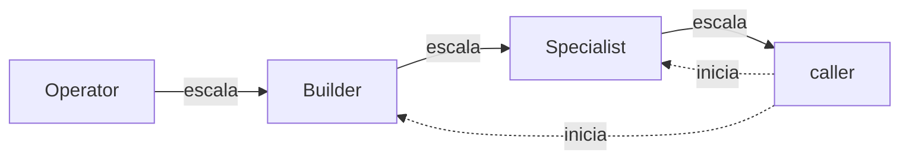

# agents

[English](README.md)

Uma escada de cinco agentes pro Claude Code e pro Codex, ordenada pela complexidade da tarefa.

## A escada

| Agente | Quando usar | Pin no Claude | Pin no Codex |
|---|---|---|---|
| Operator | A mudança já está decidida até o último detalhe |  |  |
| Researcher | Investigação somente leitura de qualquer fonte |  |  |
| Builder | Implementação com escopo, pequenas decisões, sem padrão novo |  |  |
| Specialist | Mudança transversal, sem padrão existente, risco real de correção |  |  |
| Reviewer | Validar um plano, diff, texto ou decisão antes de seguir com ele |  |  |

### Escalonamento



Cada agente trabalha no seu degrau. Quando a tarefa passa do que ele pode decidir, ele não chuta.
Ele termina com um handoff que diz qual é o próximo degrau e o que encontrou, então o **Operator**
aponta pro **Builder**, o **Builder** aponta pro **Specialist** e o **Specialist** devolve pro
caller, a sessão principal que começou o trabalho.

Só o caller inicia o **Builder** ou o **Specialist**, e é isso que as linhas pontilhadas mostram.
Nenhum agente sobe a escada sozinho, então a sessão principal continua no controle de quanto
esforço e custo cada tarefa recebe.

Qualquer agente ainda pode passar um restante já totalmente especificado pro **Operator**, ou
consultar o **Researcher** ou o **Reviewer** uma vez por pergunta. Decisões que são do usuário,
como intenção de produto, prioridade, segurança, dados pessoais ou dinheiro, sempre voltam pro
caller como uma pergunta, com as opções e o custo de cada uma.

O formato do handoff e o resto das regras ficam na seção Contract de cada arquivo de agente.

## Instalação

**Claude Code**

```
/plugin marketplace add k8adev/aiwkf
/plugin install agents@aiwkf
```

**Codex**

```
codex plugin marketplace add k8adev/aiwkf
codex plugin add agents@aiwkf
mkdir -p "${CODEX_HOME:-$HOME/.codex}/agents"
ln -s "${CODEX_HOME:-$HOME/.codex}"/.tmp/marketplaces/aiwkf/plugins/agents/codex/*.toml "${CODEX_HOME:-$HOME/.codex}/agents/"
```

O plugin só entrega a skill **orchestrate**. O Codex lê perfis de agente de `~/.codex/agents/`
ou do `.codex/agents/` de um projeto, nunca da pasta de um plugin, então são os symlinks que
instalam os agentes de fato. A skill funcionar não quer dizer que os agentes estão lá.

Se já existe um arquivo com o mesmo nome nessa pasta, o `ln -s` falha. Confira ou renomeie esse
arquivo antes, em vez de forçar o link com `-f`.

Pra remover os agentes:

```bash
find "${CODEX_HOME:-$HOME/.codex}/agents" -type l -lname '*marketplaces/aiwkf/plugins/agents/codex/*' -delete
```

Pra desenvolvimento, aponte os symlinks pro seu próprio checkout.

## Recomendado

A skill **orchestrate** é acionada pela descrição, mas não toda vez. Pra fazer a sessão principal
passar o trabalho pela escada, adicione este bloco às suas instruções globais,
`~/.claude/CLAUDE.md` no Claude Code ou `~/.codex/AGENTS.md` no Codex.

```
## Delegation

The session orchestrates: it decides, sequences and talks to me; subagents do the work.
Before any search, change, research, review or external write (MCP/API) that needs an agent, invoke the `orchestrate` skill first
(`agents:orchestrate` on Claude Code).
```

## Limites

- **Researcher** e **Reviewer** são somente leitura por contrato, não totalmente por ferramenta.
  No Claude, a lista de ferramentas não bloqueia escritas via Bash ou MCP, e o sandbox somente
  leitura do Codex também não.
- Delegação aninhada no Codex, quando o `spawn_agent` chama outro perfil, não é documentada.
  Verifique antes de depender disso.
- O caminho `.tmp/marketplaces/` do Codex é interno e não documentado. Se ele mudar, os symlinks
  quebram de um jeito visível mas inofensivo, e basta apontar de novo.
- Ainda não foi verificado se o Codex segue arquivos de agente via symlink. Confirme numa sessão
  nova.
- Não está documentado pra qual modelo o alias `opus` do Claude Code resolve hoje.
- O Claude Haiku 4.5 não tem o parâmetro `effort`, então o frontmatter do **Operator** no Claude
  não o inclui.
